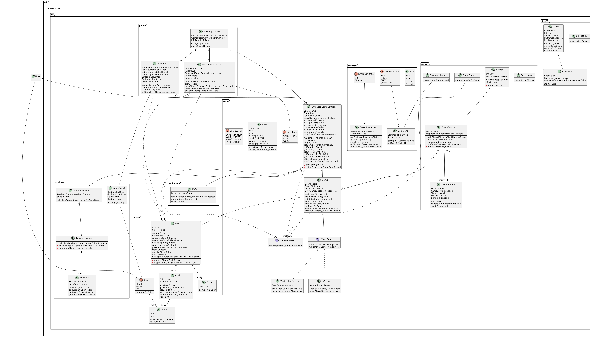
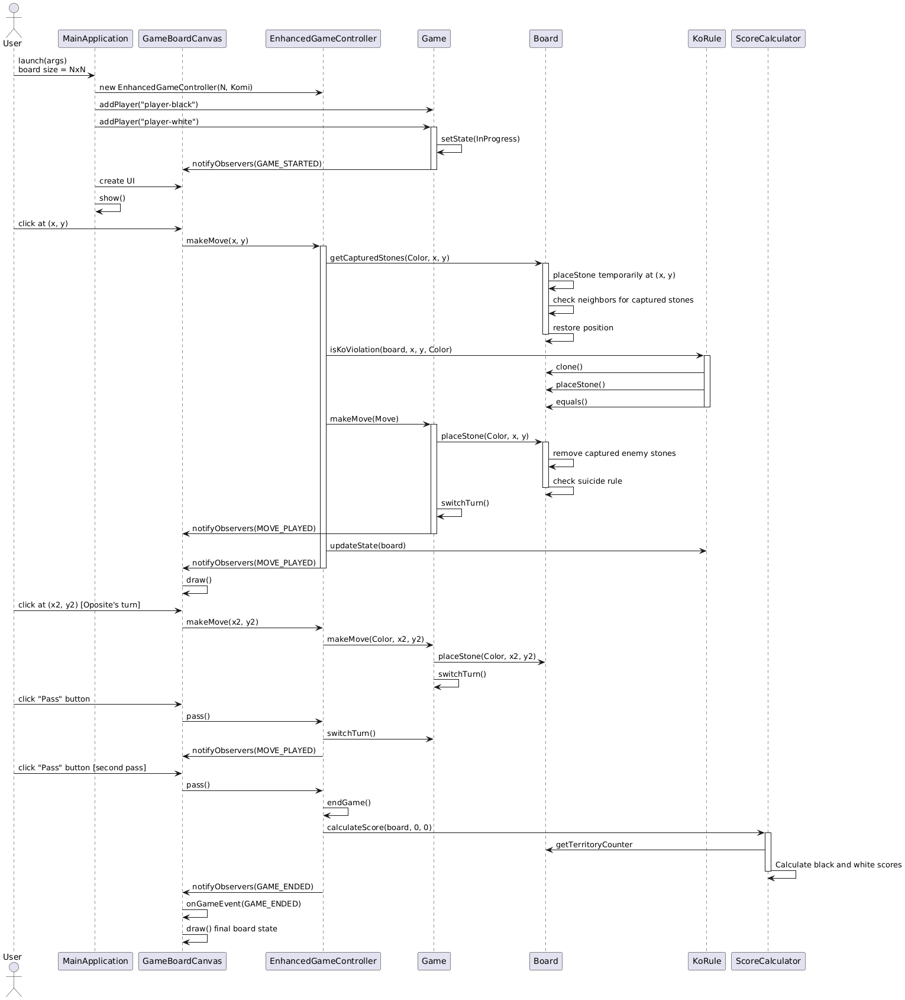
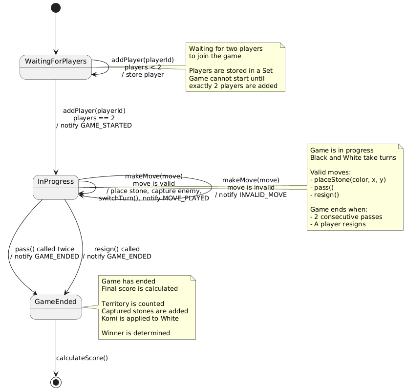
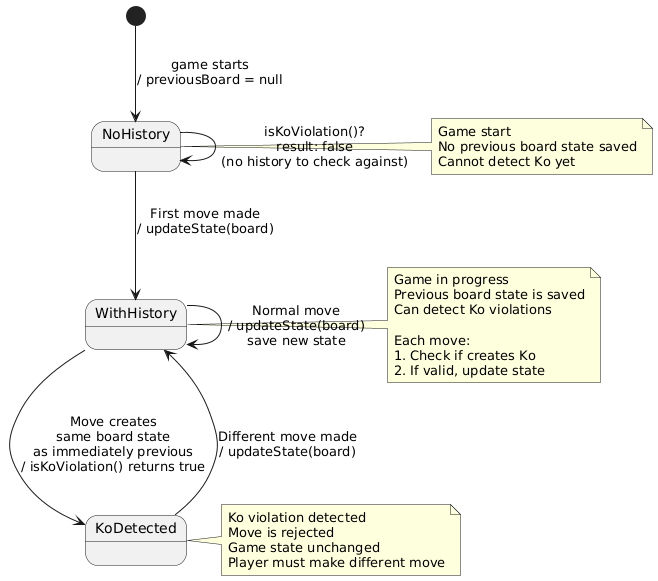

# Go-Game - Iteration 2

This is the second iteration of the Go-Game project. In this version, the UI implemented with JavaFX and board size is a parametr

## How to Run

Now game works in a hot-spot mode, so we have one board and players on one PC make turns one by one
```
mvn javafx:run
```

## Documentation

Documentation is generated with JavaDoc and can be accessed by ip-adres
```
http://localhost:8000
```
Or maven
```
mvn javadoc:javadoc -q && xdg-open target/reports/apidocs/index.html
```

## Design Patterns Used

* **Singleton**: The server is created only once to ensure a single point of control.
* **Observer**: Clients subscribe to server updates, allowing real-time communication of game state.
* **DTO (Data Transfer Object)**: Data is transferred between server and clients using separate objects to encapsulate the information.
* **Protocol / Command**: Commands are used to standardize communication between the client and server. Each action (e.g., placing a stone, passing a turn) is represented as a command or protocol message, allowing clear separation of game logic and network communication.

## Some UML-diagrams
* Class diagram
* Sequence diagram
* State diagrams
  




